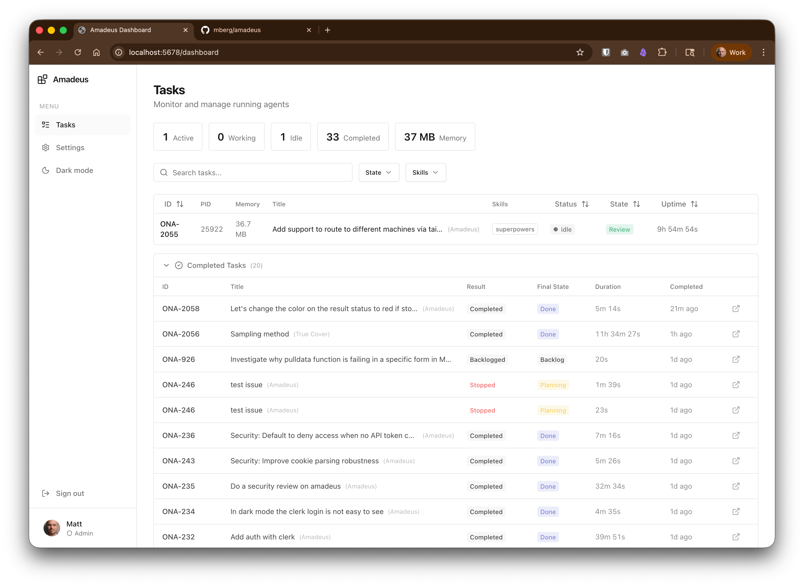
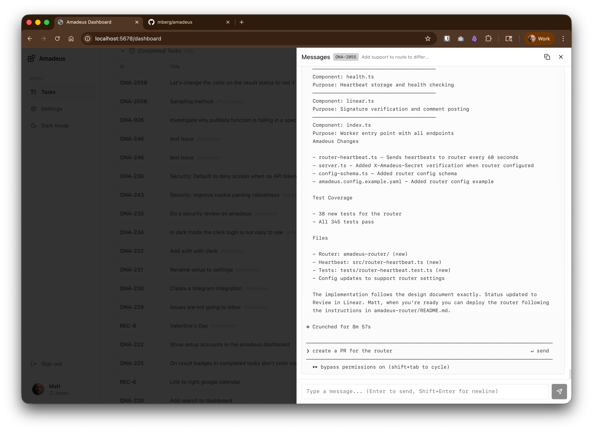

# Amadeus

Amadeus uses Linear as a control plane to manage multiple Claude Code agents. Each agent runs on a dedicated port, working on different projects. Linear's Kanban board becomes the UI for orchestrating AI-powered development.

## Dashboard

Amadeus includes a web dashboard for monitoring and managing agents:



*Tasks view showing active and completed agents with real-time status, memory usage, and filtering options.*



*Agent conversation panel showing message history and direct interaction capabilities.*

## Architecture

```
┌─────────────────────────────────────────────────────────────────────────────┐
│                              LINEAR                                         │
│  ┌─────────┐  ┌─────────┐  ┌─────────┐                                     │
│  │ Issue A │  │ Issue B │  │ Issue C │  ...                                │
│  │ ENG-123 │  │ DES-456 │  │ ENG-789 │                                     │
│  └────┬────┘  └────┬────┘  └────┬────┘                                     │
│       │            │            │                                           │
└───────┼────────────┼────────────┼───────────────────────────────────────────┘
        │            │            │
        │ webhooks   │            │ (state changes, comments)
        ▼            ▼            ▼
┌─────────────────────────────────────────────────────────────────────────────┐
│                         AMADEUS (this server)                               │
│                         localhost:5678                                      │
│                                                                             │
│  • Receives Linear webhooks                                                 │
│  • Spawns/stops agents based on issue state                                 │
│  • Routes messages to correct agent                                         │
│  • Maps Linear projects/teams to local repositories                         │
└─────────────────────────────────────────────────────────────────────────────┘
        │            │            │
        │ spawns     │            │ (one agent per issue)
        ▼            ▼            ▼
┌──────────────┐ ┌──────────────┐ ┌──────────────┐
│  agentapi    │ │  agentapi    │ │  agentapi    │
│  port 8001   │ │  port 8002   │ │  port 8003   │
│              │ │              │ │              │
│ Claude Code  │ │ Claude Code  │ │ Claude Code  │
│ /code/backend│ │ /code/design │ │ /code/backend│
└──────┬───────┘ └──────┬───────┘ └──────┬───────┘
       │                │                │
       │ Linear MCP     │                │ (agents post updates)
       ▼                ▼                ▼
┌─────────────────────────────────────────────────────────────────────────────┐
│                              LINEAR                                         │
│  Issue A: status → "Building", comment: "Starting implementation..."        │
│  Issue B: status → "Review", comment: "PR ready for review"                 │
└─────────────────────────────────────────────────────────────────────────────┘
```

### Communication Flow

**Inbound (Linear → Agent):**
1. Issue state changes in Linear (e.g., moved to "Planning")
2. Linear sends webhook to Amadeus
3. Amadeus spawns an agentapi instance for that issue (if not already running)
4. Amadeus sends issue details to the agent via HTTP

**Outbound (Agent → Linear):**
1. Each project must have Linear MCP configured (see Prerequisites)
2. Claude Code uses the Linear MCP to update issue status, post comments, etc.
3. Updates appear on the Linear issue that triggered the agent

**Key insight:** Amadeus is a one-way orchestrator. It spawns agents and sends them work, but agents communicate back to Linear directly via `linear-cli`—not through Amadeus.

## Prerequisites

You need these installed on your machine:

1. **Claude Code CLI** - The `claude` command must be available
   ```bash
   # Verify installation
   claude --version
   ```

2. **AgentAPI** - HTTP wrapper for Claude Code ([github.com/coder/agentapi](https://github.com/coder/agentapi))
   ```bash
   # Download binary for macOS
   OS=$(uname -s | tr "[:upper:]" "[:lower:]")
   ARCH=$(uname -m | sed "s/x86_64/amd64/;s/aarch64/arm64/")
   curl -fsSL "https://github.com/coder/agentapi/releases/latest/download/agentapi-${OS}-${ARCH}" -o /usr/local/bin/agentapi
   chmod +x /usr/local/bin/agentapi

   # Verify
   agentapi --help
   ```

   **macOS security note:** If you get "cannot be opened because it is from an unidentified developer", go to **System Settings → Privacy & Security** and click "Open Anyway".

3. **linear-cli** - Command-line tool for agents to interact with Linear ([github.com/Finesssee/linear-cli](https://github.com/Finesssee/linear-cli))
   ```bash
   # Install via Cargo (requires Rust)
   cargo install linear-cli

   # Or download pre-built binary from GitHub releases
   # https://github.com/Finesssee/linear-cli/releases

   # Configure your Linear API key
   linear-cli config set-key lin_api_xxxxxxxxxxxxx

   # Verify installation
   linear-cli --help
   ```

   Agents use linear-cli to post comments and update issue status. Without this, agents cannot communicate progress back to Linear.

4. **Tailscale** (optional) - For exposing webhooks to the internet via Funnel

## Quick Start

```bash
# Install dependencies
bun install

# Configure secrets
cp .env.example .env
# Edit .env with your Linear API keys and webhook secrets

# Configure realms and projects
cp amadeus.config.example.yaml amadeus.config.yaml
# Edit amadeus.config.yaml with your Linear workspaces and project paths

# Start the server
bun run start

# Expose via Tailscale Funnel (in another terminal)
tailscale funnel --bg 5678
```

## Configuration

Amadeus uses a YAML configuration file for non-sensitive settings and `.env` for secrets.

### Configuration File (amadeus.config.yaml)

Copy `amadeus.config.example.yaml` to `amadeus.config.yaml` and customize:

```yaml
realms:
  # A realm groups a Linear workspace with its projects and credentials
  ona:
    linearWorkspace: ona  # workspace slug from linear.app/ona
    apiKeyEnvVar: LINEAR_API_KEY_ONA
    webhookSecretEnvVar: LINEAR_WEBHOOK_SECRET_ONA
    claudeBotUserId: user-id-optional  # Optional: filter out bot's own comments
    projects:
      - teamKey: ONA
        linearProject: Optional Project Name  # Route by project name within team
        path: /path/to/ona/project
        profile: base
        githubRepoUrl: https://github.com/org/repo  # Optional: for PR links
      - teamKey: DESIGN
        path: /path/to/design/project
        profile: frontend

global:
  port: 5678
  agentName: Amadeus  # Label name for selective triggering
  triggerStates:
    - Planning
  useWorktrees: true
  worktreesDir: /path/to/.amadeus-worktrees
  profilesDir: ./agent-profiles
  defaultProfile: base
  dbPath: ./amadeus-agents.db  # SQLite database for persistence
  healthCheckIntervalMs: 30000
  healthCheckTimeoutMs: 5000
  security:
    enableAgentMessaging: false  # Allow dashboard users to send messages to agents
```

### Environment Variables (.env)

Secrets are stored in `.env` and referenced by name in the config file:

| Variable | Required | Description |
|----------|----------|-------------|
| `LINEAR_API_KEY_<REALM>` | Yes | Linear API key for each realm |
| `LINEAR_WEBHOOK_SECRET_<REALM>` | Yes | Webhook signing secret for each realm |
| `AMADEUS_API_TOKEN` | No | API token for simple auth mode |
| `CLERK_PUBLISHABLE_KEY` | No | Clerk publishable key (enables Clerk auth) |
| `CLERK_SECRET_KEY` | No | Clerk secret key (required with publishable key) |
| `RESEND_API_KEY` | No | Resend API key for email notifications |
| `NOTIFICATION_EMAIL` | No | Email address to send notifications to |
| `NOTIFICATION_FROM_EMAIL` | No | Email address to send notifications from |
| `TELEGRAM_BOT_TOKEN` | No | Telegram bot token for notifications |
| `TELEGRAM_CHAT_ID` | No | Telegram chat ID to send notifications to |

Example `.env`:
```bash
LINEAR_API_KEY_ONA=lin_api_xxxxxxxxxxxxx
LINEAR_WEBHOOK_SECRET_ONA=your_webhook_secret_here

# Simple auth (optional)
AMADEUS_API_TOKEN=your_secret_token

# Or Clerk auth (optional)
CLERK_PUBLISHABLE_KEY=pk_live_xxxxx
CLERK_SECRET_KEY=sk_live_xxxxx

# Notifications (optional)
RESEND_API_KEY=re_xxxxx
NOTIFICATION_EMAIL=you@example.com
NOTIFICATION_FROM_EMAIL=amadeus@example.com
TELEGRAM_BOT_TOKEN=123456:ABC-xxxxx
TELEGRAM_CHAT_ID=123456789
```

### Realms

A **realm** groups a Linear workspace with its projects and credentials. This allows Amadeus to:
- Handle multiple Linear workspaces in one instance
- Use different API keys per workspace
- Route issues to the correct repositories

Each realm contains:
- `linearWorkspace`: The workspace slug (e.g., `ona` for linear.app/ona)
- `apiKeyEnvVar`: Name of the env var containing the Linear API key
- `webhookSecretEnvVar`: Name of the env var containing the webhook secret
- `claudeBotUserId`: Optional user ID to filter out the bot's own comments
- `projects`: Array of team-to-path mappings

### Project Routing

Projects can be routed by team key and optionally by project name:

```yaml
projects:
  - teamKey: ONA
    linearProject: Amadeus  # Only issues in the "Amadeus" project
    path: /code/amadeus
  - teamKey: ONA
    linearProject: Dashboard  # Only issues in the "Dashboard" project
    path: /code/dashboard
  - teamKey: ONA
    path: /code/default  # Fallback for other ONA issues
```

### Label-Based Agent Triggering

When `agentName` is set in config (or `AGENT_NAME` env var), Amadeus only processes issues that have a matching label.

```yaml
global:
  agentName: Amadeus
```

With this setting:
- Issues **with** the "Amadeus" label → agent spawns when moved to Planning
- Issues **without** the "Amadeus" label → ignored by Amadeus

This enables selective automation—only issues explicitly labeled for AI assistance are processed. The matching is case-insensitive.

## Agent Profiles

Agent profiles let you configure different setups for different types of issues. For example, frontend issues might get Playwright for browser testing, while backend issues get database tools.

### How Profiles Work

Profiles are JSON files in the `agent-profiles/` directory. Each profile can specify:

- **MCP Servers** - Tools the agent can use (Playwright, database clients, etc.)
- **Permissions** - What commands the agent is allowed to run
- **Skills** - Claude Code skills to install from marketplaces
- **Prompt Additions** - Extra instructions appended to the agent's prompt

### Profile Format

```json
{
  "extends": "base",
  "mcpServers": {
    "playwright": {
      "command": "npx",
      "args": ["-y", "@anthropic/mcp-playwright"]
    }
  },
  "permissions": {
    "allow": ["Bash(playwright:*)"],
    "deny": []
  },
  "skills": {
    "marketplaces": ["anthropics/skills"],
    "install": ["frontend-design@anthropic-agent-skills"],
    "local": []
  },
  "promptAdditions": [
    "You have access to Playwright for browser automation.",
    "Use the frontend-design skill for UI components."
  ]
}
```

### Built-in Profiles

| Profile | Description |
|---------|-------------|
| `base` | Minimal profile with Bash/git/bun/curl permissions |
| `frontend` | Extends base with Playwright MCP and frontend-design skill |
| `frontend-design` | Lightweight profile with just the frontend-design skill |
| `superpowers` | Adds superpowers skill for structured workflows (brainstorming, planning, TDD, debugging) |

### Profile Selection

Profiles are selected in this order:

1. **Issue Labels** - Add a `profile:<name>` label to the issue (e.g., `profile:frontend`)
2. **Project Default** - Configure a default profile per project in config
3. **Global Default** - Falls back to the `base` profile

Multiple `profile:` labels on an issue will merge those profiles together.

### Profile Inheritance

Profiles can extend other profiles using the `extends` field:

```json
{
  "extends": "base",
  "mcpServers": {
    "playwright": { ... }
  }
}
```

When extending:
- MCP servers are merged (child overrides parent for same key)
- Permissions are combined (both allow and deny lists)
- Skills are combined and deduplicated
- Prompt additions are concatenated (parent first, then child)

## Dashboard Features

The web dashboard at `/dashboard` provides real-time monitoring and control of agents.

### Tasks Page

- **Real-time status** - See all active agents with their current state
- **Filtering** - Filter by Linear state (Planning, Building, Feedback Needed, Review, Done) or by active skills
- **Search** - Find agents by issue identifier or title
- **Stats bar** - Total agents, working, idle, and memory usage
- **Sortable columns** - Sort by ID, memory, title, status, state, uptime

### Task Actions

- **View messages** - Open the agent's conversation panel to see full message history
- **Stop agent** - Terminate an agent with confirmation dialog
- **Link to Linear** - Jump directly to the Linear issue

### Completed Tasks

The dashboard shows a history of completed tasks with:
- Completion reason (Done, Stopped, Canceled, Backlogged)
- Time since completion
- Task duration

### Settings Page

- **Overview tab** - Read-only summary of current configuration
- **YAML tab** - Edit configuration directly (admin role required)
  - Save changes and reload
  - Validate without saving
  - Reset to original

### Message Panel

Click on any active agent to open the message panel showing:
- Full conversation history
- Agent console output
- Ability to send messages (if enabled and authorized)

## Agent Workflow

This section describes the complete lifecycle of an agent working on a Linear issue.

### Lifecycle Overview

```
┌─────────────────────────────────────────────────────────────────────────────┐
│                           LINEAR ISSUE LIFECYCLE                            │
├─────────────────────────────────────────────────────────────────────────────┤
│                                                                             │
│  1. TRIGGER                                                                 │
│     User moves issue to "Planning"                                          │
│     ↓                                                                       │
│  2. SPAWN                                                                   │
│     Amadeus receives webhook → creates worktree → spawns agent              │
│     ↓                                                                       │
│  3. PLANNING                                                                │
│     Agent analyzes requirements → posts implementation plan                 │
│     Agent sets status → "Feedback Needed" and STOPS                         │
│     ↓                                                                       │
│  4. APPROVAL                                                                │
│     Human reviews plan → replies with approval or changes                   │
│     Amadeus forwards comment → Agent reads feedback                         │
│     ↓                                                                       │
│  5. BUILDING                                                                │
│     Agent sets status → "Building"                                          │
│     Agent implements plan → commits changes                                 │
│     ↓                                                                       │
│  6. COMPLETION                                                              │
│     Agent pushes branch → creates PR → sets "Review"                        │
│     Human reviews → merges → sets "Done"                                    │
│                                                                             │
└─────────────────────────────────────────────────────────────────────────────┘
```

### Status Updates

Agents communicate their state by updating Linear issue status using `linear-cli`:

| Status | When Set | What It Means |
|--------|----------|---------------|
| **Feedback Needed** | After posting implementation plan | Agent waiting for human approval |
| **Building** | After human approves plan | Agent is actively implementing |
| **Review** | When PR is created | Work is complete, ready for human review |

**Status commands agents use:**

```bash
# Set to Feedback Needed (plan posted, waiting for approval)
linear-cli issues update ONA-123 --state "38ab3462-5550-4dcf-a1dd-6845e3a1e963"

# Set to Building (human approved, start implementing)
linear-cli issues update ONA-123 --state "0aab3254-cc63-4979-84ab-eda800979c94"

# Set to Review (PR ready)
linear-cli issues update ONA-123 --state "e5708707-32a0-4ede-9f24-fb525d92b3d4"
```

### Comment Format

Agents post comments to Linear using `linear-cli`. All agent comments are prefixed with `**🤖 Claude:**` so humans can distinguish them:

```bash
linear-cli comments create --body "**🤖 Claude:** Starting implementation..." ONA-123
```

### Planning & Approval Loop

When an agent starts on a new issue:

1. **Agent analyzes** the issue and codebase
2. **Agent posts implementation plan** as a Linear comment
3. **Agent sets status to "Feedback Needed"** and STOPS
4. **Human reviews plan** and replies via Linear comment
5. **Amadeus forwards** the comment to the agent
6. **If approved**: Agent sets status to "Building" and implements
7. **If changes requested**: Agent updates plan and stays in "Feedback Needed"

This ensures humans approve the approach before any code is written.

### PR Creation

When work is complete, agents:

1. Push the issue branch to origin
2. Create a PR using `gh pr create`
3. Post the PR URL as a Linear comment
4. Set status to "Review"

```bash
git push -u origin issue/ONA-123
gh pr create --title "ONA-123: Feature title" --body "Resolves ONA-123"
linear-cli comments create --body "**🤖 Claude:** PR created: https://github.com/..." ONA-123
linear-cli issues update ONA-123 --state "e5708707-32a0-4ede-9f24-fb525d92b3d4"
```

### Automatic PR Merge Detection

Amadeus automatically detects when PRs are merged and updates Linear:

- Checks agents in "Review" state every 5 minutes
- Uses `gh pr view` to check merge status
- When a PR is merged:
  1. Updates Linear issue to "Done"
  2. Deletes local and remote branches
  3. Cleans up agent state

This keeps Linear in sync without manual intervention.

## Notifications

Amadeus can notify you when agents need attention via email or Telegram.

### Email Notifications (Resend)

Configure email notifications with Resend:

```bash
RESEND_API_KEY=re_xxxxx
NOTIFICATION_EMAIL=you@example.com
NOTIFICATION_FROM_EMAIL=amadeus@yourdomain.com
```

Notifications are sent when:
- An agent moves to **Feedback Needed** (plan ready for review)
- An agent moves to **Review** (PR ready for review)

### Telegram Notifications

Configure Telegram notifications:

```bash
TELEGRAM_BOT_TOKEN=123456:ABC-xxxxx
TELEGRAM_CHAT_ID=123456789
```

**Two-way communication:** You can reply to Telegram notifications to post comments back to Linear. Use the format:

```
ISSUE-123: Your comment here
```

The reply will be posted as a comment on the Linear issue.

## Authentication

Amadeus supports two authentication modes for the dashboard and API.

### Simple Mode (Default)

Uses a single API token for authentication:

```bash
AMADEUS_API_TOKEN=your_secret_token
```

- Include token in requests via `X-Amadeus-Token` header
- Without token: read-only access (viewer)
- With valid token: full access (admin)

To enable agent messaging in simple mode:

```yaml
global:
  security:
    enableAgentMessaging: true
```

### Clerk Mode

For production deployments with role-based access control:

```bash
CLERK_PUBLISHABLE_KEY=pk_live_xxxxx
CLERK_SECRET_KEY=sk_live_xxxxx
```

**Roles:**
| Role | Permissions |
|------|-------------|
| `viewer` | View dashboard, read agent status |
| `operator` | Send messages to agents, stop agents |
| `admin` | Edit configuration |

Assign roles via Clerk's user metadata (`publicMetadata.role`).

**Auth detection:** Clerk mode is enabled automatically when both env vars are set.

## Multi-Project Support

Amadeus supports running agents across multiple projects and Linear workspaces simultaneously using **realms**.

### Realm-Based Configuration

Each realm represents a Linear workspace with its projects:

```yaml
realms:
  ona:
    linearWorkspace: ona
    apiKeyEnvVar: LINEAR_API_KEY_ONA
    webhookSecretEnvVar: LINEAR_WEBHOOK_SECRET_ONA
    projects:
      - teamKey: ONA
        path: /code/amadeus
      - teamKey: DESIGN
        path: /code/design

  recode:
    linearWorkspace: recode
    apiKeyEnvVar: LINEAR_API_KEY_RECODE
    webhookSecretEnvVar: LINEAR_WEBHOOK_SECRET_RECODE
    projects:
      - teamKey: RECODE
        path: /code/recode-app
```

### Team-Based Routing

Issues are routed to repositories based on their team key:

| Team Key | Repository | Realm |
|----------|------------|-------|
| ONA | /code/amadeus | ona |
| DESIGN | /code/design | ona |
| RECODE | /code/recode-app | recode |

When an issue from team "ONA" triggers, Amadeus spawns Claude Code in `/code/amadeus` using the `ona` realm's API key.

### Example Setup

| Linear Issue | Team | Repository | Agent Port |
|-------------|------|------------|------------|
| ONA-123 | ONA | /code/amadeus | 8001 |
| ONA-124 | ONA | /code/amadeus | 8002 (different issue) |
| DESIGN-45 | DESIGN | /code/design | 8003 |

Each issue gets its own agent instance, even if multiple issues target the same project. Agents are isolated via git worktrees.

## Git Worktrees

By default, Amadeus creates a separate git worktree for each issue. This enables multiple agents to work on the same project simultaneously without file conflicts.

### Why Worktrees?

Without worktrees, two agents working on the same project would overwrite each other's file changes. With worktrees:

- Each agent gets its own complete working directory
- Each agent works on its own branch (`issue/{identifier}`)
- The main project directory stays clean
- Multiple PRs can be prepared in parallel

### Directory Structure

```
/code/backend/                    ← Main project (stays clean)
/.amadeus-worktrees/
  ├── ONA-123/                    ← Worktree for issue ONA-123
  │   └── (full project checkout on branch issue/ONA-123)
  ├── ONA-124/                    ← Worktree for issue ONA-124
  │   └── (full project checkout on branch issue/ONA-124)
  └── ONA-125/                    ← Worktree for issue ONA-125
      └── (full project checkout on branch issue/ONA-125)
```

### How It Works

1. **Agent starts** for issue `ONA-123`:
   - Amadeus checks if branch `issue/ONA-123` exists (reuses it if so)
   - Creates branch `issue/ONA-123` from current HEAD if it doesn't exist
   - Creates worktree at `../.amadeus-worktrees/ONA-123`
   - Spawns agent process in the worktree directory

2. **Agent works** in complete isolation:
   - All file changes happen in the worktree
   - Agent commits to `issue/ONA-123` branch
   - Other agents on same project are unaffected

3. **Agent completes** and pushes:
   - Agent pushes `issue/ONA-123` to origin
   - Agent creates PR from the issue branch
   - Agent sets status to "Review"

4. **Cleanup** happens when agent stops:
   - Worktree directory is removed
   - **Branch is preserved** on local and remote for PR review
   - Human can review/merge the PR at their leisure

### Configuration

```yaml
global:
  useWorktrees: true
  worktreesDir: /path/to/.amadeus-worktrees
```

### Disabling Worktrees

If you prefer agents to work directly in the project directory:

```yaml
global:
  useWorktrees: false
```

Note: Without worktrees, multiple agents on the same project may conflict with each other's file changes.

## Endpoints

### Public Endpoints

| Endpoint | Method | Description |
|----------|--------|-------------|
| `/` | GET | Redirect to dashboard |
| `/health` | GET | Health check |
| `/dashboard` | GET | Web dashboard |
| `/auth/info` | GET | Auth mode and Clerk public key |
| `/webhook` | POST | Linear webhook receiver |
| `/telegram-webhook` | POST | Telegram reply webhook |

### Authenticated Endpoints

| Endpoint | Method | Role | Description |
|----------|--------|------|-------------|
| `/status` | GET | viewer | JSON status of all running agents |
| `/status/history` | GET | viewer | Completed tasks history (paginated) |
| `/config` | GET | viewer | Dashboard config (non-secret) |
| `/config/yaml` | GET | viewer | Raw YAML configuration |
| `/config` | POST | admin | Update and reload configuration |
| `/config/validate` | POST | admin | Validate YAML without saving |
| `/trigger` | POST | operator | Send message to agent: `{"agentKey": "...", "message": "..."}` |
| `/agents/:key/messages` | GET | viewer | Proxy agent conversation messages |
| `/agents/:key/stop` | POST | operator | Stop a running agent |

## Linear Setup

1. Go to **Settings → API** in Linear
2. Create a new webhook pointing to `https://your-machine.ts.net/webhook`
3. Select events: Issues, Comments
4. Save the signing secret as `LINEAR_WEBHOOK_SECRET`

### Workflow States

Configure your Linear workflow with these states for best results:

| State | What Happens |
|-------|--------------|
| **Planning** | Agent spawns, analyzes requirements, creates plan, then sets Feedback Needed |
| **Feedback Needed** | Agent waiting for human approval of plan |
| **Building** | Human approved plan, agent actively coding |
| **Review** | Agent finished, PR created, awaiting human review |
| **Done** | Human approved and merged |

#### YOLO Mode

For tasks where you trust the agent to proceed without approval, add "yolo" to the issue description. In YOLO mode, agents skip the "Feedback Needed" state and go directly from Planning to Building.

Normal workflow: `Planning → Feedback Needed → Building → Review → Done`
YOLO workflow: `Planning → Building → Review → Done`

#### Termination States

Agents automatically terminate when issues move to these states:

| State | Effect |
|-------|--------|
| **Backlog** | Agent terminates (issue deprioritized) |
| **Canceled** | Agent terminates (work stopped) |
| **Draft** | Issue is skipped entirely (not ready for work) |

This ensures agents don't continue working on abandoned or deprioritized issues.

### Agent Runtime States

Beyond Linear workflow states, Amadeus tracks internal agent states for process management.

#### Process Status

Each agent process has a runtime status:

| Status | Meaning |
|--------|---------|
| **starting** | Agent process is spawning, waiting for readiness checks |
| **idle** | Agent is ready and waiting for messages |
| **working** | Agent is actively processing a message |
| **stopped** | Agent has been terminated |

Transitions: `starting` → `idle` (health check passes) → `working` (message sent) → `idle` (processing complete)

The dashboard displays these statuses to show which agents are actively processing work.

#### Health/Persistence Status

Agents are monitored for crashes and can recover automatically:

| Status | Meaning |
|--------|---------|
| **alive** | Agent is responsive and operational |
| **dead** | Agent crashed or stopped responding |

When an agent dies and a user posts a comment on the Linear issue, Amadeus automatically respawns the agent with context from the previous session, allowing work to continue.

## Tailscale Funnel Setup

Tailscale Funnel exposes your local Amadeus server to the internet so Linear can send webhooks to it. This is the recommended approach for development and personal use.

### Install Tailscale

1. **Download and install Tailscale** from [tailscale.com/download](https://tailscale.com/download)

2. **Authenticate with your Tailscale account:**
   ```bash
   tailscale login
   ```

3. **Verify Tailscale is running:**
   ```bash
   tailscale status
   ```

### Enable Funnel

Funnel requires HTTPS and must be enabled in your Tailscale admin console:

1. Go to [login.tailscale.com/admin/acls](https://login.tailscale.com/admin/acls)
2. Add the following to your ACL policy (or enable via the UI under DNS → Funnel):
   ```json
   {
     "nodeAttrs": [
       {
         "target": ["*"],
         "attr": ["funnel"]
       }
     ]
   }
   ```

### Start Funnel for Amadeus

```bash
# Start Amadeus server first
bun run start

# In another terminal, expose port 5678 via Funnel
tailscale funnel --bg 5678
```

The `--bg` flag runs Funnel in the background. Your server is now accessible at:
```
https://<your-machine-name>.<tailnet-name>.ts.net/
```

To find your Funnel URL:
```bash
tailscale funnel status
```

### Configure Linear Webhook

Use your Funnel URL as the webhook endpoint in Linear:

1. Go to **Linear → Settings → API → Webhooks**
2. Set the webhook URL to: `https://<your-machine>.ts.net/webhook`
3. Select events: **Issues**, **Comments**
4. Copy the signing secret to your `.env` as `LINEAR_WEBHOOK_SECRET`

### Funnel Commands Reference

```bash
# Start Funnel (foreground)
tailscale funnel 5678

# Start Funnel (background)
tailscale funnel --bg 5678

# Check Funnel status
tailscale funnel status

# Stop Funnel
tailscale funnel off
```

### Troubleshooting

**Funnel not working?**
- Ensure Tailscale is connected: `tailscale status`
- Verify Funnel is enabled in your admin console
- Check that MagicDNS is enabled in your Tailscale admin

**Webhook verification failing?**
- Confirm the URL in Linear matches your Funnel URL exactly
- Ensure `LINEAR_WEBHOOK_SECRET` in `.env` matches the secret shown in Linear

## Security

Amadeus grants significant autonomy to AI agents. Understand these security implications before deploying.

### Trust Model

**Agent Permissions**

Agents run with `--dangerously-skip-permissions`, granting them:
- Full read/write access to the project directory and git worktree
- Ability to execute arbitrary shell commands
- Network access for API calls, package installation, etc.

This is required for autonomous operation. There is no sandboxing beyond the git worktree boundary.

**Localhost Access**

Each agent runs an agentapi HTTP server on localhost (ports 8001+) without authentication. Any process on the machine can:
- Send messages to agents
- Read agent conversation history
- Trigger agent actions

This is acceptable for single-user development machines. For shared servers, consider additional isolation (containers, VMs, separate user accounts).

**Webhook Verification**

Linear webhooks are verified using HMAC-SHA256 signatures:
- Each webhook includes a `linear-signature` header
- Amadeus validates this against your `LINEAR_WEBHOOK_SECRET`
- Invalid signatures are rejected with 401 Unauthorized

Keep your webhook secret confidential. Rotate it if compromised.

### Deployment Considerations

**Network Exposure**

Only the `/webhook` and `/telegram-webhook` endpoints should be exposed to the internet. Keep these endpoints internal:
- `/status` - Agent status information
- `/dashboard` - Visual dashboard
- `/trigger` - Manual agent control
- `/config` - Server configuration

If using a reverse proxy, allowlist only webhook endpoints for external access.

**Secrets Management**

Required secrets:
- `LINEAR_WEBHOOK_SECRET` - Validates incoming webhooks

Recommended secrets:
- `LINEAR_API_KEY` - For agents to update Linear via linear-cli
- `ANTHROPIC_API_KEY` - For Claude Code (typically in user environment)

Never commit `.env` files. The repository includes `.env` in `.gitignore`.

**Suitable Environments**

Amadeus is designed for:
- Personal development machines
- Dedicated CI/CD runners
- Isolated cloud instances

Not recommended for:
- Shared multi-user servers (without containerization)
- Production environments with sensitive data
- Machines where untrusted users have local access

### Process Isolation

**Git Worktrees**

Each agent operates in an isolated git worktree:
- Agents cannot interfere with each other's file changes
- Each worktree is on a dedicated branch (`issue/{identifier}`)
- Worktrees are cleaned up when agents stop

**Environment Variables**

Agents inherit environment variables from the Amadeus process, plus:
- `LINEAR_ISSUE_ID` - The Linear issue ID
- `LINEAR_ISSUE_IDENTIFIER` - The issue identifier (e.g., ONA-123)

Be mindful of sensitive variables in your environment.

### Review Practices

Always review agent output before merging:
- Check PRs for unintended changes
- Verify agents haven't modified files outside their scope
- Review commit history for unexpected patterns
- Test changes in a staging environment when possible

## Development

```bash
# Run tests
bun test

# Run tests in watch mode
bun test --watch

# Interactive chat with Claude Code (for testing agentapi integration)
bun run chat
```

## Credits

Amadeus builds on these excellent tools:

- **[AgentAPI](https://github.com/coder/agentapi)** by Coder - HTTP wrapper that enables programmatic control of Claude Code
- **[linear-cli](https://github.com/Finesssee/linear-cli)** by Finesssee - Command-line tool for Linear that agents use to post comments and update issues
- **[Claude Code](https://claude.com/claude-code)** by Anthropic - The AI coding assistant that powers each agent
- **[Linear](https://linear.app)** - The issue tracker that serves as Amadeus's control plane
